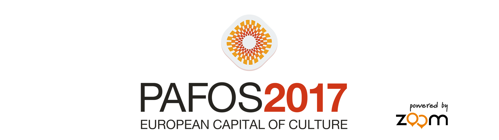

# PAFOS2017 - European Capital of Culture
[](https://play.google.com/store/apps/details?id=com.trackandtalk.pafos17)

This is the source for *"Pafos2017 - European Capital of Culture"* official Android app.

Made in Pafos, Cyprus by the [Zoom Cyprus](http://www.zoomcy.com/) team, using only the freshest local ingredients.

Features
-------------

* See upcoming cultural events and easily navigate to the venues
* Get notified about events you add to your favourites
* Explore the city of Pafos and its interesting cultural landmarks
* Favourite events get backed up to the cloud
* Works offline


Build environment
--------------

The app uses some Google services, which need developer keys and a configuration file. These aren't included in the project, so if you want to build it yourself, you'll need to provide your own.

You'll also need to provide a backend with your own REST endpoints. A string resource file points to those endpoints

- A `google-services.json` file in the `/app/` folder. Required for Google Sign In. [Instructions here](https://developers.google.com/identity/sign-in/android/start-integrating)
- A `youtube_key.txt` file, which contains your own key, in the root project folder. Required for the YouTube Android player API, as we're playing a video in one of the Intro screens. [Instructions here](https://developers.google.com/youtube/android/player/)
- A `google_maps.txt` file, which contains your own google maps key, in the root project folder. [Instructions here](https://developers.google.com/maps/documentation/android-api/signup)
- The `api_endpoints.xml` string resources. Contains the paths (as strings) to the REST backend, placed in `/app/src/main/res/values/`

When all's said and done, your project should look like this:

```
Pafos2017/google_maps.txt
Pafos2017/youtube_key.txt
Pafos2017/app/google-services.json
Pafos2017/app/src/main/res/values/api_endpoints.xml
```

Screenshots
-----------


Support
-------

If you see anything wrong, file an issue.

Alternatively, contact [Konstantinos (@papageorgiouk)](https://twitter.com/papageorgiouk) or [Charalambos (@xinaris)](https://twitter.com/xinaris)

Pull requests welcome! Point them to the `requests` branch. Open an issue first and reference it in your PR

License
-------
```
Copyright (C) 2016 Track & Talk Ltd

Licensed under the Apache License, Version 2.0 (the "License");
you may not use this file except in compliance with the License.
You may obtain a copy of the License at

    http://www.apache.org/licenses/LICENSE-2.0

Unless required by applicable law or agreed to in writing, software
distributed under the License is distributed on an "AS IS" BASIS,
WITHOUT WARRANTIES OR CONDITIONS OF ANY KIND, either express or implied.
See the License for the specific language governing permissions and
limitations under the License.
```
